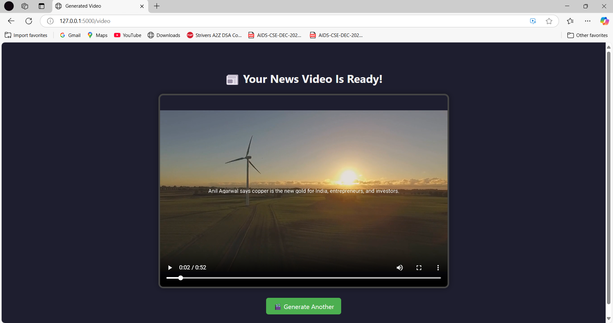

# 📰 AI News Video Generator

Turn **real-time news** into **short, shareable news videos** — fully automated with AI.




## 🚀 About the Project

This project takes a current news headline and:
1. Generates a professional video script using an LLM.
2. Adds catchy, attention-grabbing lines.
3. Converts the script to audio using Azure TTS.
4. Generates a short video with dynamic overlays.

All of this happens in a single click — and runs on an Microsoft Azure Virtual Machine server or your own Local Machine.

---

## ⚙️ Features

- 🔍 Real-time news scraping
- 🧠 LLM-generated script and catchy one-liners
- 🎤 Azure-based text-to-speech synthesis
- 🎬 Dynamic video generation with MoviePy
- 🌐 Python Flask web interface

---

## 📦 Tech Stack

- **Python**
- **Flask** (Web Framework)
- **Azure Cognitive Services** (Text-to-Speech)
- **MoviePy** (Video generation)
- **LLM APIs** (DeepSeek, LM Studio, or OpenAI compatible)
- **Bootstrap + HTML** (Frontend)

---

## 📁 Folder Structure

```
video_generation_tool/
│
├── app.py                         # Main Flask app
├── news_scraping.py              # Fetches latest news
├── generate_script.py            # Script generation using LLM
├── generate_catchy_lines.py      # One-liner generation
├── convert_text_to_speech.py     # Azure TTS integration
├── video_generation.py           # Video creation logic
├── templates/
│   ├── index.html
│   └── video.html
├── static/
│   └── videos/
├── .env                          # Stores API keys (not pushed)
|── assets/                       # Handles images stored in Readme.md file
└── requirements.txt              # List of all dependencies of the project
```

---

## 🛠️ Setup Instructions

### 1. Clone the Repo
```bash
git clone https://github.com/akshatkhatri/video_generation_tool.git
cd video_generation_tool
```

### 2. Create a Virtual Environment
```bash
python3 -m venv venv
source venv/bin/activate  # On Windows: venv\Scripts\activate
```

### 3. Install Dependencies
```bash
pip install -r requirements.txt
```

### 4. Configure API Keys

Create a `.env` file in the root with your keys:
```env
API_KEY=your_news_api_key
SPEECH_KEY=your_azure_speech_key
SERVICE_REGION=your_azure_region
```

### 5. Run the App
```bash
python app.py
```
Visit `http://127.0.0.1:5000` in your browser.

---

## 🧠 Model Config (LLM)

The app uses a local or hosted LLM to generate scripts. You can:
- Connect it to **LM Studio**, **OpenRouter**, or **DeepSeek API**
- Set your LLM endpoint inside relevant script generation files

---

## 🖼 Example Output

- News video with voiceover and animated text overlay
- Stored in `static/videos/final_video_with_generated_text_overlay.mp4`

---

## 💡 Future Improvements

- Category-based video templates
- Support for multiple languages
- User-uploaded custom text

---

## 🤝 Contributing

PRs and suggestions are welcome!  
Just fork, commit your changes, and open a pull request.

---

## 📄 License

[MIT License](LICENSE)